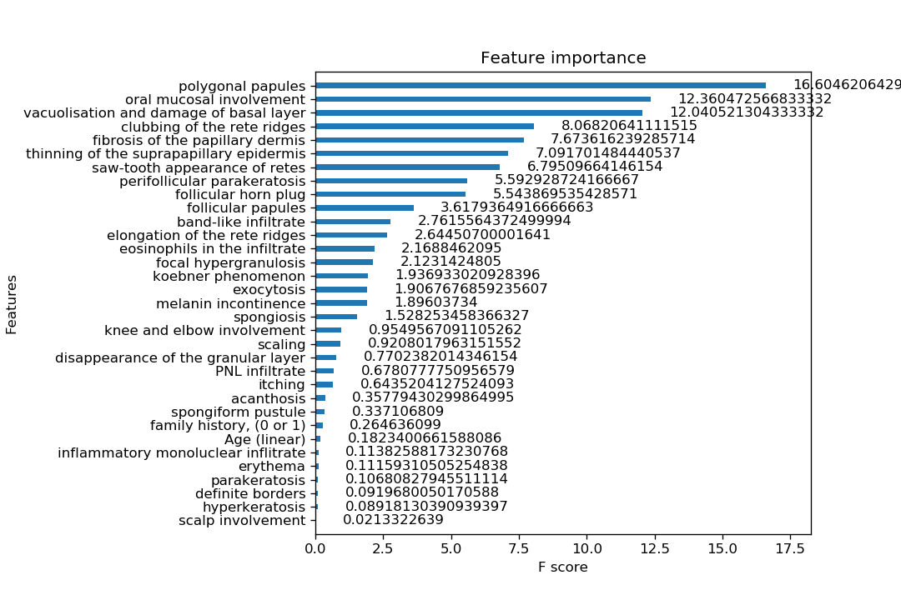
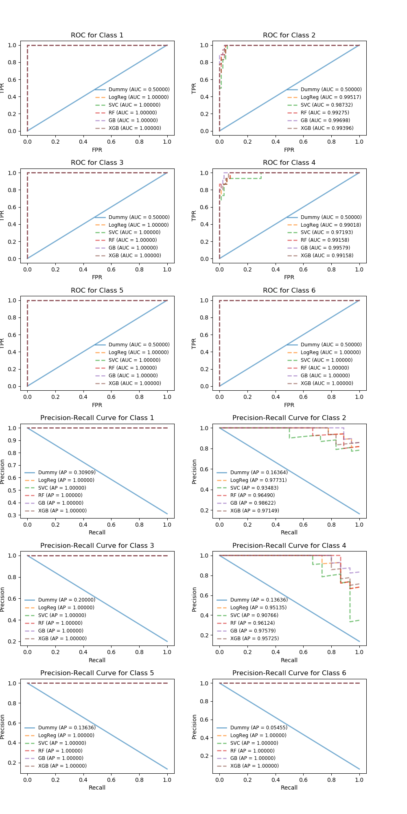

- Aim at correctly classifying diseases based on their clinical and histopathological features

- Techniques include:

  -  Dummy classifier as baseline
  -  Logistic regression
  - Support vector classifier
  - Random forest
  - Gradient boosting
  - XGBoost
  - Feature importance using XGBoost Plot_ importance()
  
  - Customize cv scoring
  - Customize refit scoring to pick unique set of hyperparameters if multiple sets achieve the same best test score
  - Compare models with ROC and precision-recall curve (PRC)
  

- ### Comments

  #### Results

  - Based on F1-macro score, the `winning model is XGBoost!`
  - XGBoost had the highest values for other metrics as well except for AUC(ROC)
  - XGBoost with and without missing value imputation achieved the same F1 score
    - It might be data-dependent, need larger sample size to justify this
  - Surprisingly, logistic regression classifier performed better than tree-based algorithms
  - SVC had the worst area under precision-recall curve
  - F1 score was more differentiating than AUC(ROC)
    - This phenonmenon can also be observed in ROC vs precision-recall curve (PRC)
    - With skewed class distributions, especially when modifying multiclass classification problem to one-over-rest (ovr) classification, large amount of true negatives gives rise to low false positive rate and hence too optimistic AUC(ROC)
  - Dummy classifier, as expected, has zero predicting power; its kappa is no better than chance agreement
  - Mean AP for XGBoost no-impute version is intentionally skipped

  #### About choosing evaluation metrics

  - F1-macro, average precision, and Cohen's kappa are preferred to accuracy and AUC(ROC) when classes are imbalanced

  - As with many other classification problems with multi-, imbalanced class data, this exercise aims at classifying the minority (i.e. positive) class correctly. Therefore, evaluation metrics stressing on the positive class are more applicable than accuracy and AUC, which can exaggerate prediction success due to huge amount of true negatives from the majority (i.e. negative) class. Some metric options like precision (proportion of predicted positives being truly positive) and recall (proportion of ground true positives being predicted correctly) are good candidates. For the sake of convenience when comparing models, it is handy to summarize the inversely related precision and recall scores with averaged F1 and mean average precision. When averaging F1 scores, macro-averaging is chosen over micro-averaging because with macro-averaging, the score from each class is weighted equally without bias from the dominant class. Average precision, just like AUC(ROC), summarizes the precision-recall curve (PRC). It is a recall-weighted average precision and is used to represent as the area under PRC. It is not strictly equal to area under curve as the area is not linear interpolated.

  - Cohen's kappa is another excellent choice here as it measures the agreement between true labels and predictions adjusted for chance agreement for >=2 classes regardless of class imbalance.

  #### About tuning models

  - The models sometimes after fine-tuning hyperparameters resulted in worse test score
    - Maybe the test set was too small to include the same data structure as the training set

  - For XGBoost, once number of iterations and learning rate were set, there was not much room for model improvement by tuning other hyperparameters

  #### About class weight vs sample weight

  - Since gradient boost and XGBoost algorithms do not have `class_weight` parameter, to adjust for class imbalance, class weights are calculated and applied to each instance as `sample_weight` argument in fit() method
  - Not sure why class_weight = 'balanced' specification achieved a better cv score than class weights calculated as k/sum(k), where k = class_weight.compute_class_weight('balanced')

  #### About refit scoring

  - When multiple sets of hyperparameters have the same best cv test score, it is not sure how grid search picks the best set of hyperparameters, or best_index_ (suspect it picks the one with the lowest number of iterations). This decision making logic: Max(F1-macro) > Max(Accuracy) > Max(AUROC), is implemented as user-defined callabe argument for grid search `refit` scoring.

  #### Improvement

  - It would be better to start with a dataset of decent size
  - Current dataset has n = 366 obs vs 34 features --, after 70/30 train-test split the training set is left with 256 obs for 5-fold cv
