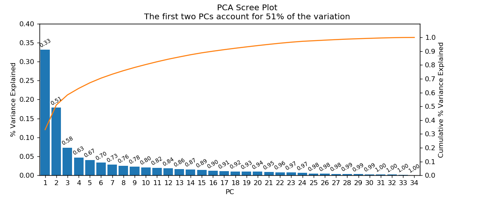
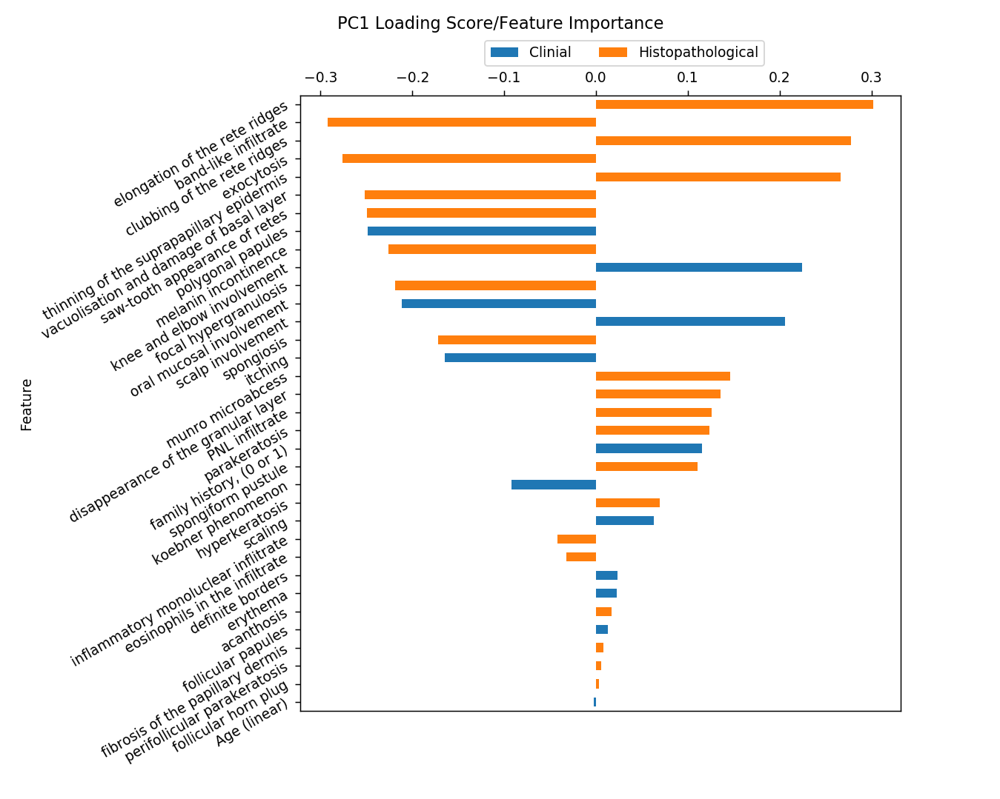
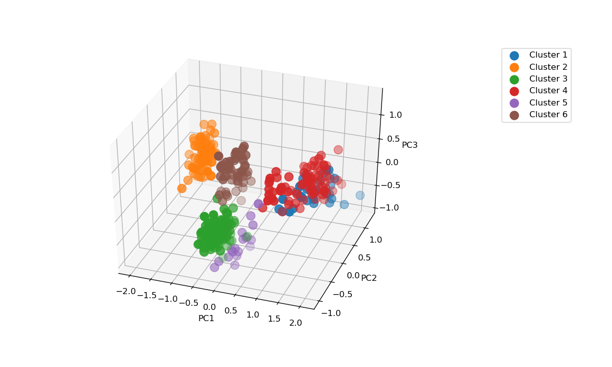
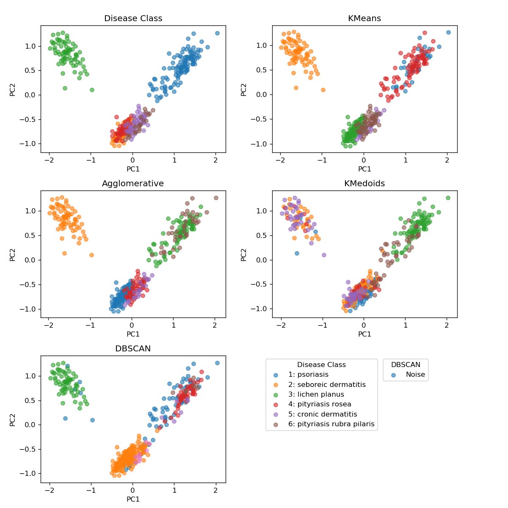

* Aim at understanding the features of different types of dermatology diseases

- Techniques include PCA and K-Means clustering

  1. Screen plot to check importance of principal components, and how much information will be thrown away if use only first 2 -3 PCs to visualize data 

  2. Underlying features for the PC -- are they mostly clinical or histopathological? 

  3. 3D scatter plot for K-Means clustering of the first three PCs to entertain human eyes 

  4. Are there better ways to cluster this data? Looks like K-Means is the winner.

